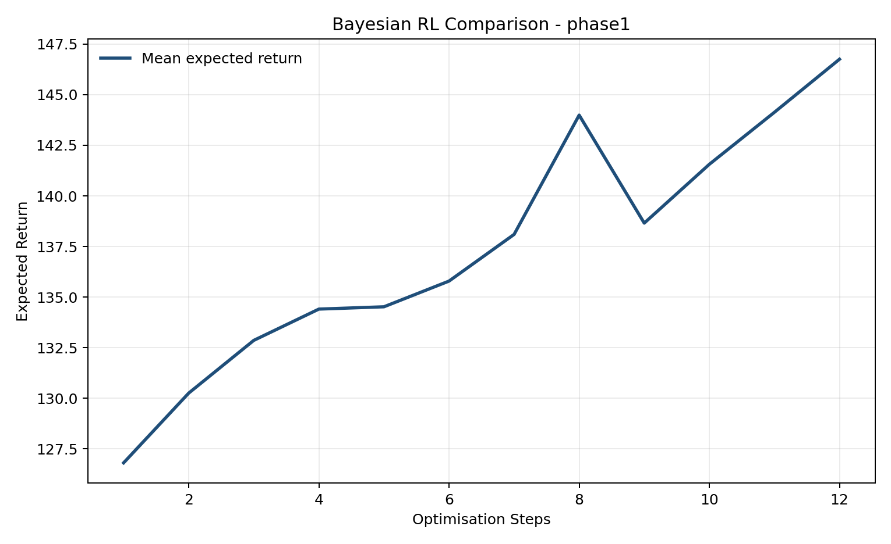

# Research & Engineering Projects Archive

A curated, centralised repository capturing foundational and empirical implementations spanning Reinforcement Learning, Applied Statistics, and Sequential Decision-Making under Uncertainty.

## Core Research Directory
- `/policy-learning-stability`: Robust policy gradients under non-stationary reward scaling regimes. (Completed)
- `/bayesian-rl-meets-mcmc`: Bayesian reinforcement learning with MCMC-VI posterior estimation for sample-efficient uncertainty quantification. Phase 1-4 complete, including Privacy-Preserving Analysis and the final Differential Privacy Integration milestone.

## Experimental Results Gallery

The Bayesian RL project archives visualisation artefacts under `bayesian-rl-meets-mcmc/results/plots/` using filenames of the form `{phase}_{env_id}_{tag}_{timestamp}_{descriptor}.png`.

Additional Phase 3 posterior and Phase 4 Differential Privacy Analysis figures should be placed in the corresponding phase folders once exported from the completed benchmark runs.
