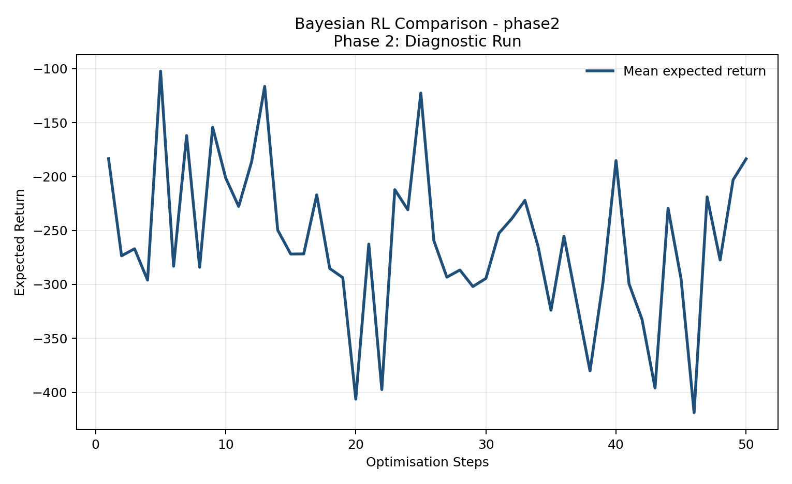
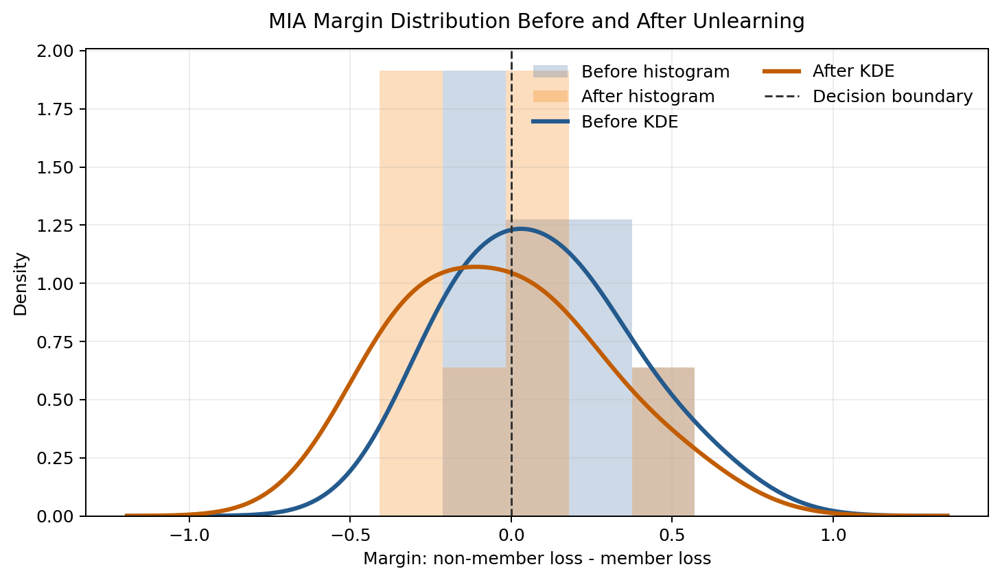
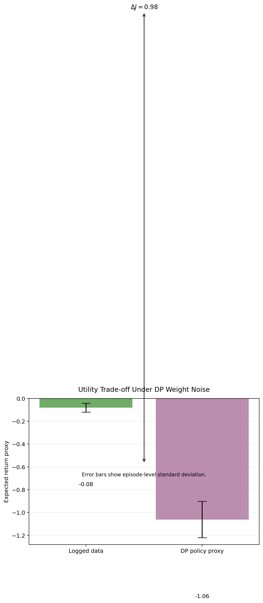

# Research & Engineering Projects Archive

A curated, centralised repository capturing foundational and empirical implementations spanning Reinforcement Learning, Applied Statistics, and Sequential Decision-Making under Uncertainty.

## Core Research Directory
- `/policy-learning-stability`: Robust policy gradients under non-stationary reward scaling regimes. (Completed)
- `/bayesian-rl-meets-mcmc`: Bayesian reinforcement learning with MCMC-VI posterior estimation for sample-efficient uncertainty quantification. Phase 1-4 complete, including Privacy-Preserving Analysis and the final Differential Privacy Integration milestone.
- `/trustworthy-offline-rl-via-dp`: Multi-domain trustworthy offline RL with trajectory-level Differential Privacy, machine unlearning, and IQL validation across medical and financial proxies. (Completed)

## Project Logs

### Stability of Bayesian-SAC under Non-Stationary Reward Scaling

The `policy-learning-stability` project studies whether entropy-regularised continuous-control policies remain stable when reward magnitudes drift over time. It uses a Gymnasium reward wrapper to induce sinusoidal and abrupt-collapse scaling regimes, then couples SAC-style actor-critic learning with a Bayesian temperature controller guided by a Gaussian Process surrogate.

Core contributions:

- Formalises reward scaling as a non-stationary process $\tilde{r}_t = \alpha_t r_t$ and tracks how changing reward magnitude can miscalibrate static entropy schedules.
- Implements Bayesian entropy-temperature adaptation so the policy can retain uncertainty-aware exploration when reward evidence becomes sparse or compressed.
- Provides MuJoCo/Ray-oriented experiment scaffolding, automated visualisation, and diagnostics for collapse variance under sinusoidal drift and abrupt reward collapse.

[View Details](./policy-learning-stability/README.md)

### Bayesian RL Meets MCMC

The `bayesian-rl-meets-mcmc` project records a completed four-phase programme for posterior-aware reinforcement learning under data scarcity:

- **Phase 1:** Low-data diagnostic infrastructure, Variational Actor-Critic baselines, SGLD building blocks, and report-facing calibration, regret, effective sample size, and PAC-Bayes metrics.
- **Phase 2:** MuJoCo validation loops and stability analysis for continuous-control benchmarks, including regret-oriented comparison against brittle point-estimated exploration.
- **Phase 3:** MCMC-based posterior and hyperparameter analysis, with SGLD posterior traces over policy and selected RL hyperparameters across HalfCheetah-v4, Ant-v4, Hopper-v4, and Humanoid-v4.
- **Phase 4:** Privacy-preserving analysis and Differential Privacy integration, including clipped/noisy training hooks, epsilon sensitivity studies, privacy-budget plots, and final posterior/performance artefacts.

This archive therefore captures the complete path from sample-efficiency diagnostics through SGLD/MCMC posterior estimation and the completed regret-analysis milestone.

[View Details](./bayesian-rl-meets-mcmc/README.md)

## Experimental Results Gallery

The Bayesian RL project archives visualisation artefacts under `bayesian-rl-meets-mcmc/results/plots/` using the official `{phase}_{env_id}_{type}.png` naming convention.

### Phase 1 Diagnostic


### Phase 3 Posterior

| Environment | Posterior | Performance |
| --- | --- | --- |
| HalfCheetah-v4 |  |  |
| Ant-v4 |  |  |
| Hopper-v4 |  |  |
| Humanoid-v4 |  |  |

### Differential Privacy Analysis


## Stability & Regret Analysis

Frequentist epsilon-greedy exploration can accumulate linear regret, $O(T)$, when point-estimated value functions remain miscalibrated in data-scarce regimes. The Bayesian RL project instead uses posterior sampling: Thompson-style policies are drawn from the learned posterior, giving the standard sub-linear Bayesian regret target $\tilde{O}(\sqrt{dT})$.



### Phase 4 Privacy-Preserving Performance

| Environment | Posterior | Performance |
| --- | --- | --- |
| HalfCheetah-v4 |  |  |
| Ant-v4 |  |  |
| Hopper-v4 |  |  |
| Humanoid-v4 |  |  |

## Download Technical Brief (LaTeX)

The full archive file is available at `bayesian-rl-meets-mcmc/docs/technical_brief.tex`.

```latex
\documentclass[conference]{IEEEtran}
\usepackage{amsmath,amssymb,graphicx,booktabs,hyperref}
\title{Bayesian RL Meets MCMC: Posterior Estimation for Sample-Efficient and Privacy-Preserving Control}
\author{\IEEEauthorblockN{Research Engineering Brief}}
\begin{document}
\maketitle
\begin{abstract}
We summarise a four-phase Bayesian reinforcement learning project validated on HalfCheetah-v4, Ant-v4, Hopper-v4, and Humanoid-v4.
\end{abstract}
\section{Method}
The method combines variational actor-critic updates with SGLD posterior recalibration, hyperparameter posterior estimation, and differential privacy analysis.
\section{Regret}
Epsilon-greedy exploration may incur $O(T)$ regret under severe data scarcity, whereas Bayesian Thompson Sampling targets $\tilde{O}(\sqrt{dT})$ Bayesian regret.
\section{Conclusion}
Posterior estimation improves the stability and auditability of reinforcement learning under scarce data and privacy constraints.
\end{document}
```

## Trustworthy Offline RL via DP & Machine Unlearning (Completed)

The completed `trustworthy-offline-rl-via-dp` research line establishes a multi-domain framework integrating trajectory-level Differential Privacy, machine unlearning, and Implicit Q-Learning for sensitive healthcare and financial sequence data.

This completed project establishes a multi-domain framework integrating trajectory-level Differential Privacy $(\varepsilon \approx 2.74)$ and Implicit Q-Learning (IQL) to guarantee secure sequence optimisation without the out-of-distribution value-collapse typical of CQL under heavy gradient noise.

The implementation demonstrates deterministic seed-based execution and high-fidelity domain proxies for MIMIC-III sepsis treatment and FinRL trading. This architecture audits privacy leakage risk and decision-making loss transparently, separating the effect of DP noise from uncontrolled database access or irreproducible sampling.

### Featured Cross-Domain Plots

| Medical Domain (MIMIC-III Sepsis Proxy) | Financial Domain (FinRL Trading Proxy) |
| --- | --- |
|  |  |
| MIA distribution collapse indicating strong membership indistinguishability $(\varepsilon \approx 2.74)$. | In-sample expectile regression showing tight utility-gap containment $(\Delta J \approx 0.98)$ under private perturbations. |

Core contributions:

- Implements trajectory-level DP-SGD with episode-wise clipping and RDP-compatible privacy accounting.
- Implements LiSSA influence-function unlearning and SISA shard identification for deletion requests.
- Adds `PrivacyAwareIQL`, reducing DP-induced gradient variance by relying on in-sample expectile regression rather than OOD action sampling.
- Adds MIMIC-III-style and FinRL-style loaders through a shared `EpisodeBatch` abstraction.

[View Details](./trustworthy-offline-rl-via-dp/README.md)
