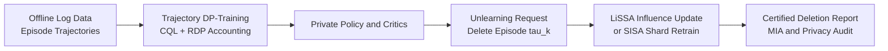

# Trustworthy Offline RL via Differential Privacy and Machine Unlearning

This project is a compact research implementation of privacy-preserving offline reinforcement learning for regulated, high-stakes decision systems. Healthcare trajectories, financial interaction logs, and other longitudinal records may encode sensitive membership and behavioural signals; a model trained on those logs needs both measurable privacy loss and a deletion path that can be audited when a data subject invokes erasure rights.

The framework combines trajectory-level Differential Privacy (DP), Conservative Q-Learning (CQL), influence-function unlearning, and SISA-style episode sharding. It is designed as a transparent implementation scaffold for discussing GDPR Article 17 deletion workflows, HIPAA-aware minimisation, and the practical tension between offline RL utility, privacy noise, and post-training removal requests.

## Pipeline



## What Is Implemented

- `optimizer.py` implements a bespoke PyTorch `TrajectoryDPSGD` optimiser. It sums transition losses for each episode, computes an explicit raw tensor gradient for that trajectory, clips the trajectory gradient to a phase-dependent norm `C`, injects Gaussian noise, and records an RDP-compatible budget estimate.
- `models.py` implements a compact continuous-action CQL agent. Its privacy-aware regulariser penalises positive out-of-distribution critic gaps more strongly when DP noise is present.
- `unlearning.py` implements LiSSA recursion for influence-function updates, a Gaussian noise interface for privatised unlearning corrections, and `EpisodeShardManager` for SISA-style episode-preserving deletion.
- `main.py` runs a synthetic offline RL workflow that trains with trajectory DP, deletes an episode, applies LiSSA unlearning, reports affected shards, and compares a threshold Membership Inference Attack (MIA) before and after deletion.

## Mathematical Foundations

Trajectory-level adjacency treats one full episode as the privacy unit. The trajectory sensitivity target is

$$
\Delta = \max_{\tau, \tau'} \left\| \nabla \ell(\tau) - \nabla \ell(\tau') \right\|_2.
$$

The optimiser therefore clips a gradient after transitions from the same trajectory have been aggregated. Standard transition-level DP-SGD instead clips each transition contribution independently, which protects a smaller adjacency unit and can understate the exposure of longitudinal logs.

For deletion auditing, the intended unlearning certificate is expressed as

$$
d_{\mathcal{TV}}\left(\mathcal{M}(\mathcal{D}), \mathcal{M}(\mathcal{D} \setminus \tau_k)\right) \leq \epsilon.
$$

LiSSA approximates the second-order removal direction

$$
H_\theta^{-1}\nabla_\theta \ell(\tau_k),
$$

without materialising a dense Hessian. SISA complements this local correction by keeping all transitions from an episode inside one shard, so a deletion request identifies bounded retraining work.

## Architecture

```text
trustworthy-offline-rl-via-dp/
  main.py        Synthetic training, deletion, RDP, and MIA CLI demo.
  models.py      ABC-backed offline RL API and privacy-aware CQL model.
  optimizer.py   Trajectory aggregation, adaptive clipping, Gaussian DP noise.
  unlearning.py  LiSSA influence updates, privatised updates, SISA sharding.
  utils.py       Episode tensors, synthetic data, and MIA simulation helpers.
```

## Quick Start

Create an environment with PyTorch available, then run from this directory:

```bash
python main.py --steps 8 --episodes 18 --delete-episode 3
```

The CLI prints the early and late clipping phases, an RDP budget estimate, the SISA shard IDs that need retraining for the deletion request, and the MIA report:

```text
step=00 clip=1.30 ...
step=07 clip=0.80 ...
rdp_budget={...}
deleted_episode=3 sisa_retrain_shards=[0]
mia_report={...}
```

To simulate a stronger deletion workload:

```bash
python main.py --steps 16 --episodes 36 --episode-batch-size 8 --shards 6 --delete-episode 11
```

### Smoke Test and Dynamic Visualisation

Use the compact smoke test to verify the core contract quickly:

```bash
python main.py --steps 8 --episodes 18 --delete-episode 3
```

For a 16-step multidimensional audit run, first run genuine training and write the latest metrics log:

```bash
python main.py --steps 16 --episodes 36 --episode-batch-size 8 --shards 6 --delete-episode 11
```

Then render the high-resolution figures from that exact experiment log:

```bash
python visualise.py --metrics-json results/plots/latest_visualise_metrics.json
```

`main.py` writes a reusable metrics log, and `visualise.py` only reads that log before rendering:

```text
results/plots/latest_visualise_metrics.json
results/plots/plot_privacy_utility.png
results/plots/plot_unlearning_margin.png
results/plots/plot_utility_tradeoff.png
```

To regenerate figures from a saved experiment log without rerunning training:

```bash
python visualise.py --metrics-json results/plots/latest_visualise_metrics.json
```

To use a named metrics log for a sweep, move or archive the JSON written by `main.py`, then pass it explicitly:

```bash
python visualise.py --metrics-json results/plots/metrics_steps16_episodes36.json
```

To run the full 16-step workflow and regenerate all evaluation figures in sequence:

```bash
python main.py --steps 16 --episodes 36 --episode-batch-size 8 --shards 6 --delete-episode 11 && python visualise.py --metrics-json results/plots/latest_visualise_metrics.json
```

The dynamic plots summarise:

```text
step-wise RDP epsilon and clipping norm
before/after MIA margin distributions
logged-return vs DP-policy proxy utility trade-off
```

## Training and Deletion Flow

1. Offline episodes are generated or loaded as `EpisodeBatch` objects.
2. CQL computes transition objectives inside each episode.
3. `main.py` sums each episode objective before passing one scalar per episode to `TrajectoryDPSGD`.
4. The optimiser uses raw tensor gradients to clip each trajectory, inject Gaussian noise, and release an averaged update.
5. A deletion request selects one episode. LiSSA estimates its influence removal direction with an optional private noise mechanism.
6. `EpisodeShardManager` identifies the shard whose retraining and policy distillation workflow would be refreshed under SISA.
7. The MIA simulation compares membership leakage signals before and after unlearning.

## Compliance-Oriented Notes

- DP is a risk-control mechanism, not a blanket legal certification. The RDP estimate in this scaffold is intentionally visible so production accounting choices can be reviewed.
- GDPR Article 17 motivates a deletion workflow for user-contributed trajectories. Machine unlearning reduces the need to retrain every model from scratch, while shard boundaries make retraining scope auditable.
- HIPAA and financial compliance programmes still require data governance, access control, retention policies, provenance, and evaluation on the real deployment threat model.

## Extension Points

- Replace the synthetic episodes with healthcare or finance log loaders that preserve episode IDs.
- Swap the compact CQL critic for an IQL actor/value decomposition while retaining the trajectory optimiser contract.
- Add a production-grade subsampled Gaussian RDP accountant and deletion certificates backed by empirical retraining comparisons.
- Retrain only affected SISA shards and distill the shard ensemble into a serving policy via `EpisodeShardManager.distillation_loss`.
